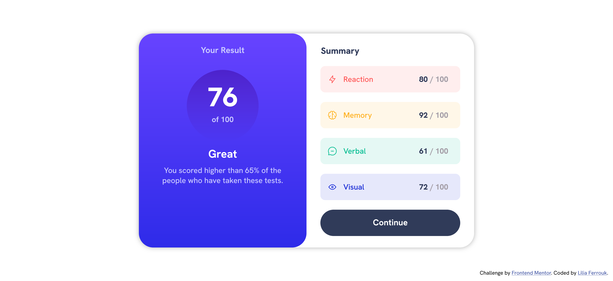
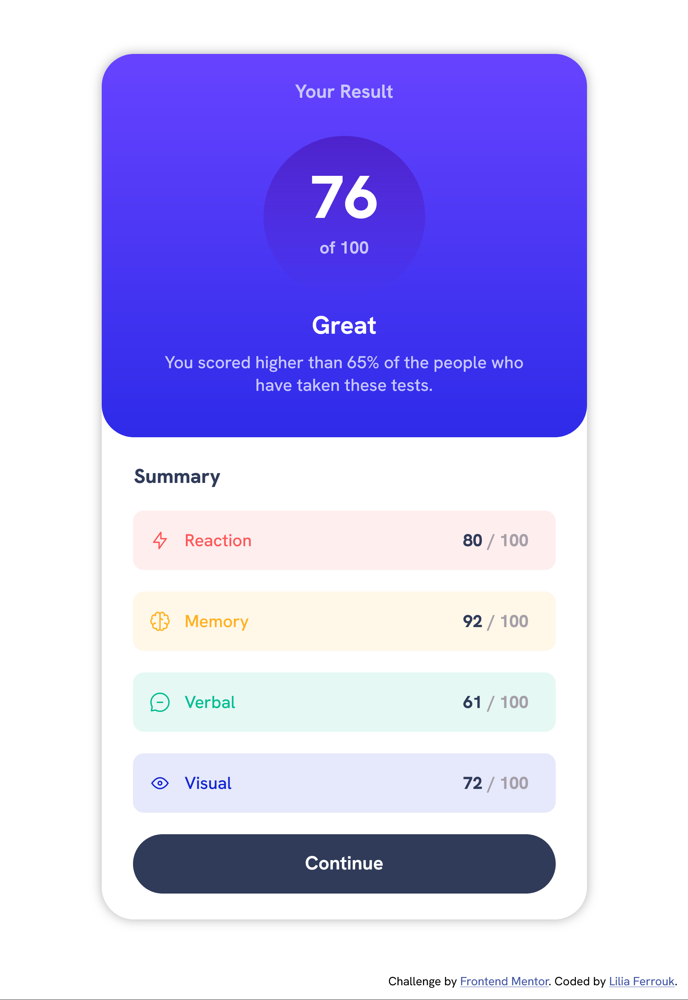
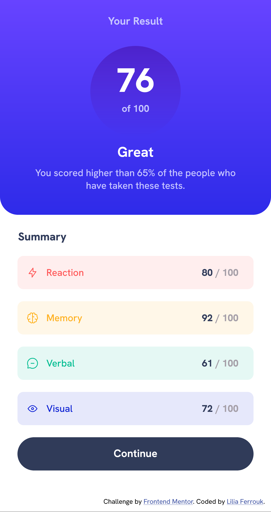

# Frontend Mentor - Results summary component solution

This is a solution to the [Results summary component challenge on Frontend Mentor](https://www.frontendmentor.io/challenges/results-summary-component-CE_K6s0maV). Frontend Mentor challenges help you improve your coding skills by building realistic projects. 

## Table of contents

- [Overview](#overview)
  - [The challenge](#the-challenge)
  - [Screenshot](#screenshot)
  - [Links](#links)
- [My process](#my-process)
  - [Built with](#built-with)
- [Author](#author)

## Overview

### The challenge
Throughout this project, the primary challenge revolved around creating these responsive web pages using the programming language of my choice.

### Screenshot
A screenshot of my solution from a desktop:

An other one from a tablet:

An other one from a mobile:

### Links

- Solution URL: [github.com/liliaferrouk/results-summary-component-main](https://github.com/liliaferrouk/results-summary-component-main)
- Live Site URL: [liliaferrouk.github.io/results-summary-component-main/](https://liliaferrouk.github.io/results-summary-component-main/)

## My process

### Built with

- HTML5
- CSS

## Author

- Frontend Mentor - [@liliaferrouk](https://www.frontendmentor.io/profile/liliaferrouk)